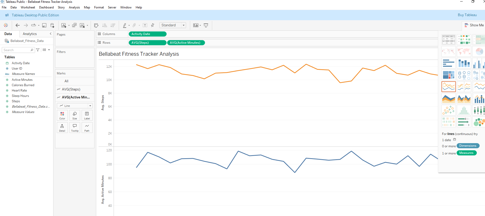
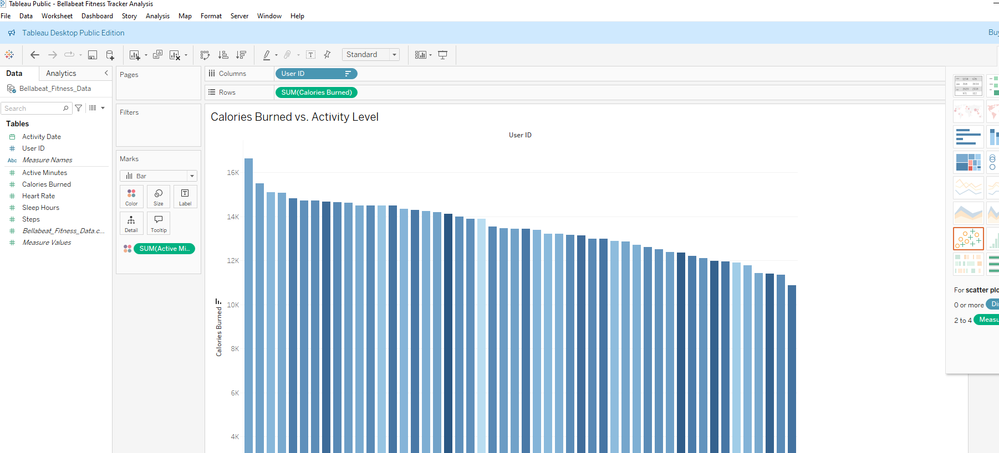

# Bellabeat Fitness Tracker Analysis (Google Data Analytics Capstone)

This project analyzes smart fitness tracker data from Bellabeat, a wellness tech company, to uncover user activity, sleep, and heart rate patterns. It was completed as part of the Google Data Analytics Capstone to demonstrate proficiency in SQL, Excel, and Tableau.

---

## Project Goal

Help Bellabeat better understand user behavior and generate insights that can guide marketing strategies and product recommendations.

---

## Key Questions Answered

- How do users’ daily steps and active minutes fluctuate?
- Does increased activity lead to higher calorie burn?
- How does sleep duration affect heart rate?

---

## Tools Used

- SQL (Data Cleaning & Analysis)
- Excel (Initial exploration)
- Tableau (Dashboard & visualization)
- GitHub (Project documentation)

---

## Dataset Summary

- **File:** `Bellabeat_Fitness_Data.csv`
- **Rows:** 1,500 (50 users × 30 days)
- **Columns:**
  - `user_id`: Unique user
  - `activity_date`: Day of activity
  - `steps`, `active_minutes`, `calories_burned`
  - `sleep_hours`, `heart_rate`

---

## SQL Scripts Included

- `data_cleaning.sql`: Handles missing values, fixes formatting
- `user_behavior_analysis.sql`: Explores daily activity patterns
- `activity_trends.sql`: Identifies broader fitness trends

---

## Tableau Visualizations

### Steps & Active Minutes Over Time

### Calories Burned vs Activity Level

### Sleep Patterns vs Heart Rate

### Final Tableu Dashboard 

> *(Dashboard created in Tableau, file: `Bellabeat Fitness Tracker Analysis.twbx`)*

---

## Key Insights

• Users with higher daily steps tend to burn significantly more calories  
• Sleep duration shows correlation with lower resting heart rate  
• Activity intensity peaks during afternoon hours  
• Consistent moderate activity leads to more stable sleep patterns

---

## How to Recreate This Project

1. Clone this repo and download all files
2. Run `.sql` scripts in BigQuery
3. Open `.csv` in Tableau or Excel
4. Import `.twbx` file to view dashboard

---

## Future Enhancements

- Predictive analytics for personalized fitness plans
- Analyze heart rate variability and stress markers
- Integrate wearables API for real-time tracking

---

## 👤 Author

**Akash Pandya**  
Freelance Data Analyst | R, SQL, Tableau, Excel  
[Portfolio Website](https://aakashpandya.netlify.app/) • [GitHub](https://github.com/akashpandya) • [LinkedIn](https://www.linkedin.com/in/akash-pandya100/)

---

